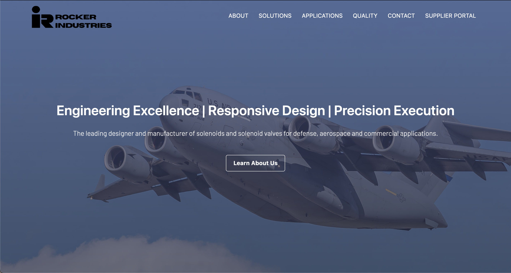
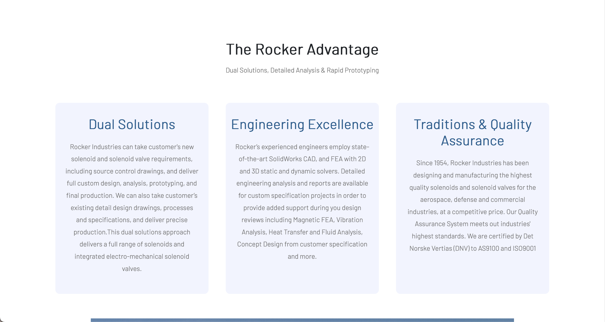
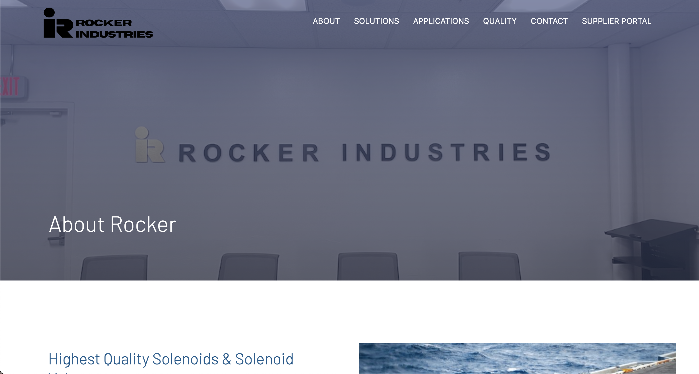
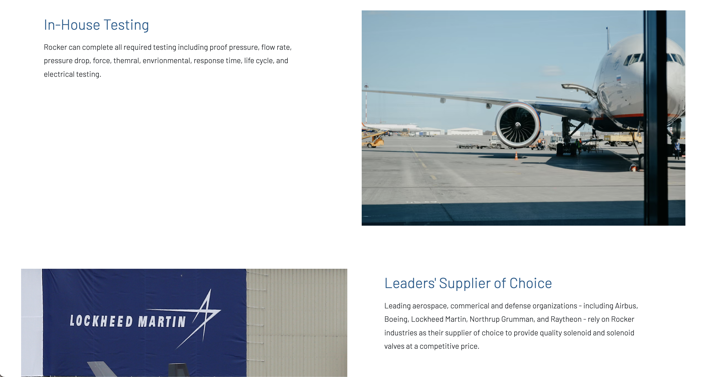
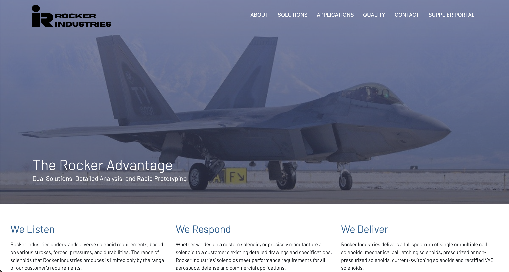
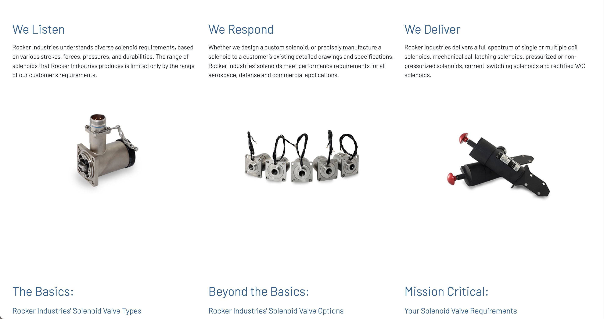
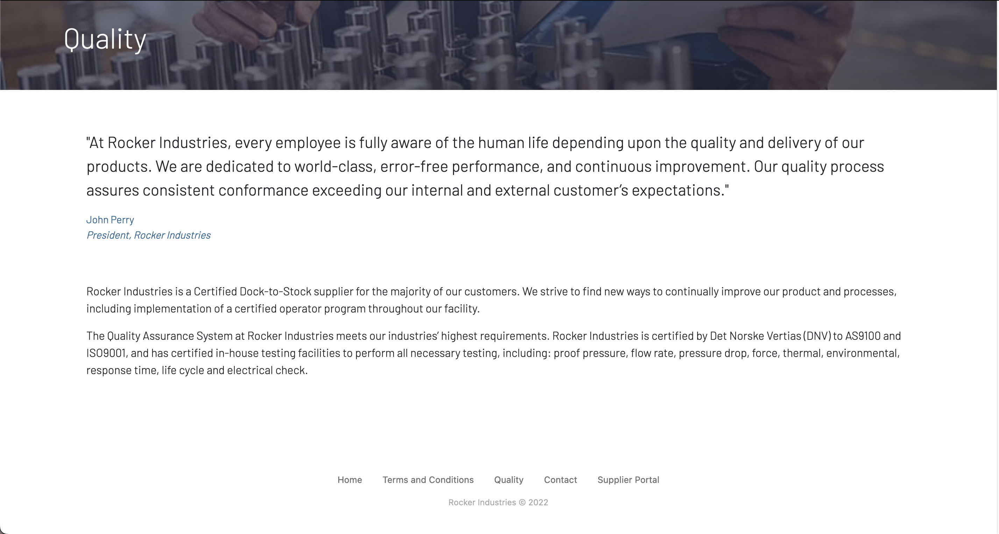
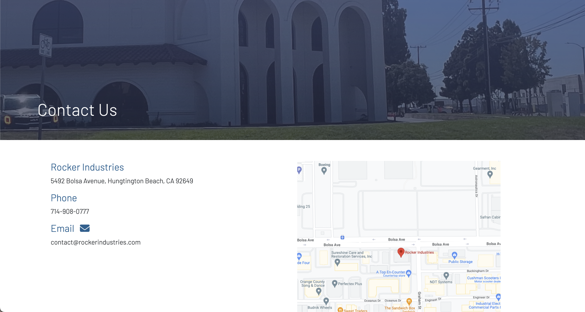

# Rocker Industries website

Over the summer I started learning front end web development (HTML, CSS, JS) and my first project I decided to create a website for the company that I was working for at the time. Some of the images on the website are photos I took on my phone when I was there. Learned about HTML, CSS, Bootstrap, JavaScript, Flexbox, and more.

